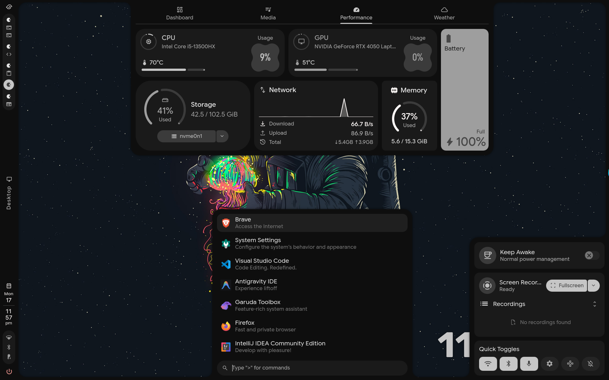
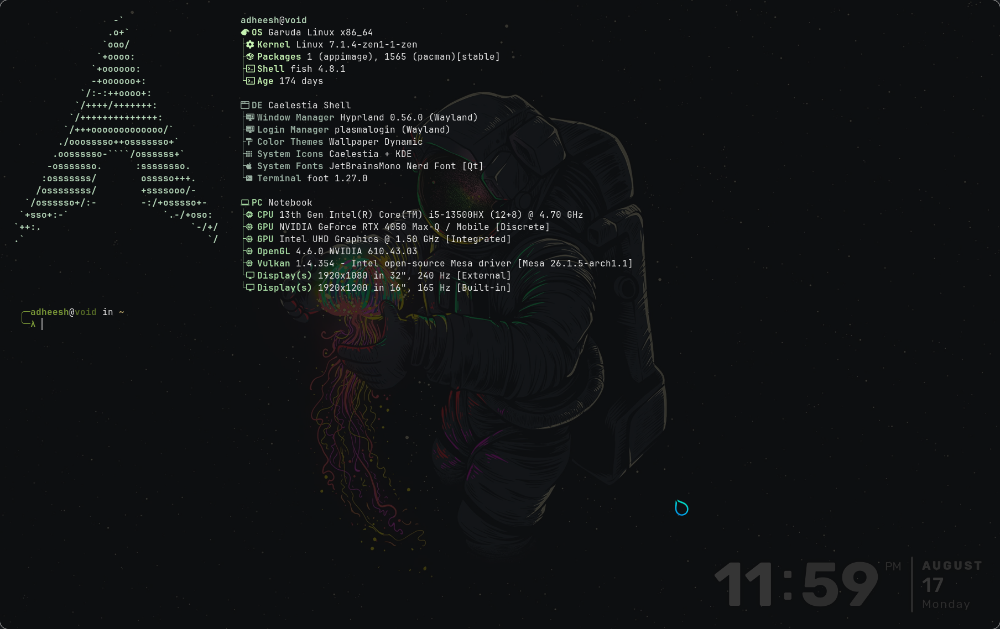
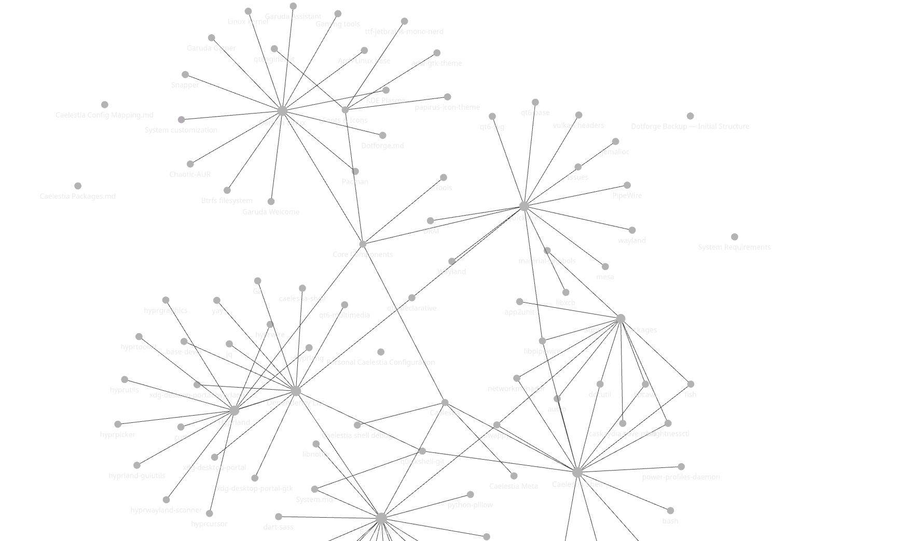

<div align="center">

# 🔨 DotForge

**Forge your desktop from a bare Arch install.**

Personal Linux desktop bootstrap & configuration restoration tool.


---

*Simple. Personal. Reproducible.*

</div>

<br>


---

## ✨ What is DotForge?

DotForge is a personal bootstrap tool that takes a **bare Arch Linux installation** and transforms it into a fully configured **Hyprland + Caelestia** desktop — then preserves the configurations that matter.

It is **not** a universal dotfiles framework, a package manager, or a replacement for Caelestia. It is a thin orchestration layer that connects existing Linux tools to reproduce one specific workflow: **mine**.

```text
Bare Arch  →  paru  →  Hyprland  →  Caelestia  →  Your configs  →  Your desktop
```

> DotForge doesn't try to replace the Linux ecosystem.
> It simply forges my preferred environment from the tools that already exist.

---

## ⚙️ Features

- 🏗️ **One-command bootstrap** — go from bare Arch to a full Hyprland desktop
- 📦 **Automated paru installation** — builds from the AUR if not already present
- 🖥️ **Hyprland + supporting packages** — compositor, portals, fonts, icons
- 🌙 **Caelestia integration** — installs and runs the Caelestia desktop environment
- 🐟 **Personal config restore** — Fish shell, Starship prompt, Fastfetch
- 💾 **Backup to Git** — snapshot your personal configuration with a single command
- 🔒 **Non-root enforcement** — refuses to run as root to protect your system

---

## 📋 Prerequisites

### System Requirements

| Requirement | Details |
|---|---|
| **Distribution** | Arch Linux or Arch-based |
| **Architecture** | x86_64 |
| **RAM** | 8 GB recommended |
| **Storage** | 10 GB free space |
| **Network** | Working internet connection |
| **Privileges** | `sudo` access (do **not** run as root) |
| **Package manager** | `pacman` available |

### Desktop Stack

DotForge is built around this specific stack:

| Tool | Role |
|---|---|
| **Hyprland** | Wayland compositor |
| **Caelestia** | Desktop environment layer |
| **Fish** | Interactive shell |
| **Starship** | Shell prompt |
| **Fastfetch** | System information display |

> [!NOTE]
> DotForge is designed and tested for this exact stack. It may work on other Arch-based setups, but the primary target is a Hyprland + Caelestia workflow.

---

## 📥 Installation

### Quick Start

```bash
git clone <YOUR-REPOSITORY-URL>
cd DotForge
chmod +x scripts/*.sh
./scripts/install.sh
```

### What happens

The installer performs these steps in order:

| Step | Action |
|:---:|---|
| 1 | Verifies the system is Arch-based and not running as root |
| 2 | Updates the package database via `pacman -Syu` |
| 3 | Installs `paru` from the AUR (if not already present) |
| 4 | Installs Hyprland and supporting packages |
| 5 | Installs `caelestia-cli` through `paru` |
| 6 | Runs `caelestia install` |
| 7 | Restores personal configuration via `restore.sh` |


### Packages installed

The installer explicitly installs the following via `pacman`:

```text
hyprland
xdg-desktop-portal-hyprland
xdg-desktop-portal-gtk
ttf-jetbrains-mono-nerd
noto-fonts
noto-fonts-emoji
papirus-icon-theme
ugrep
```

And via `paru`:

```text
caelestia-cli
```

Caelestia handles its own additional dependencies when `caelestia install` runs.

---

## 💾 Backup & Restore

### Backup

Capture your current personal configuration into the repository:

```bash
./scripts/backup.sh
```

```text
Live configuration  →  backup.sh  →  DotForge repo  →  Git
```

The backup script:

1. Copies your **Fastfetch** config from `~/.config/fastfetch/`
2. Copies your **Starship** config from `~/.config/starship.toml`
3. Stages the changes in Git
4. Prompts you to commit

> [!TIP]
> `backup.sh` automatically detects if nothing has changed and exits cleanly — no empty commits.

### Restore

Apply the configurations stored in the repository to your system:

```bash
./scripts/restore.sh
```

```text
DotForge repo  →  restore.sh  →  Live configuration
```

The restore script places:

| Configuration | Source | Destination |
|---|---|---|
| Fastfetch | `backup/fastfetch/` | `~/.config/fastfetch/` |
| Fish | `backup/fish/` | `~/.config/fish/` |
| Starship | `backup/starship.toml` | `~/.config/starship.toml` |

Each item is skipped gracefully if its backup doesn't exist in the repository.

> [!IMPORTANT]
> DotForge only restores **your personal** configuration. It does not touch Caelestia's internal files — those are managed by `caelestia install`.

---

## 📁 Repository Structure

```text
DotForge/
│
├── backup/                     # Personal configuration backups
│   ├── fastfetch/
│   │   └── config.jsonc        # Fastfetch configuration
│   ├── fish/
│   │   ├── config.fish         # Fish shell configuration
│   │   └── completions/        # Fish completions
│   │       ├── bun.fish
│   │       └── copilot.fish
│   ├── starship.toml           # Starship prompt configuration
│   └── .gitignore              # Excludes transient / generated files
│
├── scripts/
│   ├── install.sh              # Full bootstrap from bare Arch
│   ├── restore.sh              # Restore personal configs to system
│   └── backup.sh               # Capture personal configs from system
│
└── README.md
```

### Key directories

| Path | Purpose |
|---|---|
| `backup/` | Stores personal configuration files tracked by Git |
| `scripts/` | The three core scripts that make up DotForge |

### What's in `.gitignore`

The backup directory's `.gitignore` explicitly excludes transient and generated files that shouldn't be version-controlled — things like Caelestia's scheme cache, Spicetify theme artifacts, btop logs, and Fish's internal variable store.

---

## 🧩 Components

| Component | Purpose | Managed by |
|---|---|---|
| Arch Linux | Base operating system | — |
| `pacman` | System package management | Arch |
| `paru` | AUR package management | DotForge installs it |
| Hyprland | Wayland compositor | DotForge installs it |
| XDG Desktop Portals | Screen sharing, file dialogs | DotForge installs them |
| Fonts & Icons | JetBrains Mono Nerd, Noto, Papirus | DotForge installs them |
| Caelestia CLI | Desktop environment setup | DotForge installs it, Caelestia configures itself |
| Fish | Interactive shell | Caelestia / user |
| Starship | Shell prompt | User config restored by DotForge |
| Fastfetch | System info display | User config restored by DotForge |
| Git | Version control | Tracks DotForge repository |

> **DotForge orchestrates these tools. It does not replace them.**

---

## 🔄 Configuration Philosophy

DotForge follows one simple rule:

> **Back up what I personally care about. Ignore everything else.**

If Caelestia generates hundreds of configuration files during `caelestia install`, DotForge doesn't need to know about them. Caelestia handles those.

DotForge only preserves the configurations that I explicitly want to **own** and **reproduce**:

- My Fastfetch layout
- My Fish shell config and completions
- My Starship prompt theme

This separation makes DotForge **resilient to upstream changes**. If Caelestia restructures its internals in a future release, DotForge doesn't break — because it never touched those files. It simply runs:

```bash
paru -S caelestia-cli
caelestia install
```

…and Caelestia takes care of itself.

---

## 📝 Git Workflow

DotForge does not reinvent version control. Git already does that.

The intended workflow is straightforward:

```text
1. Tweak your desktop configuration
2. Run backup.sh
3. Review the staged changes
4. Commit when satisfied
5. Push to your remote (optional)
```


`backup.sh` handles the staging and prompts for commit. You're always in control of what gets committed.

---

## 🖼️ Screenshots

> Screenshots of the configured desktop will be added here.

| Preview | Description |
|---|---|
|  | Bare Arch → Configured desktop |
|  | Fastfetch system info display |
|  | Dependency Graph |

---

## ⚠️ Limitations

DotForge is intentionally narrow in scope. It does **not**:

- Support distributions outside the Arch family
- Manage all dotfiles on the system
- Configure Hyprland beyond installing it
- Replicate Caelestia's internal setup
- Provide a GUI or TUI
- Synchronize configuration across multiple machines
- Include a plugin or extension system

These are not missing features — they are deliberate boundaries.

---

## 🛠️ Extending DotForge

To track additional personal configuration:

1. Add a copy step to `backup.sh` for the new config
2. Add the corresponding restore step to `restore.sh`
3. Update the `git add` paths in `backup.sh`

Keep it simple. If a tool manages its own configuration, let it.

---

## 🙏 Credits

- [**Caelestia**](https://github.com/caelestia-dots/caelestia) — the desktop environment that makes this setup beautiful
- [**Caelestia CLI**](https://github.com/caelestia-dots/cli) — installer and management tool for Caelestia
- [**Caelestia Shell**](https://github.com/caelestia-dots/shell) — the Quickshell-based desktop shell
- [**Hyprland**](https://github.com/hyprwm/Hyprland) — Wayland compositor
- [**paru**](https://github.com/Morganamilo/paru) — AUR helper
- [**Starship**](https://github.com/starship/starship) — cross-shell prompt
- [**Fastfetch**](https://github.com/fastfetch-cli/fastfetch) — system information tool
- [**Fish**](https://github.com/fish-shell/fish-shell) — interactive shell

---

## 📄 License

This project is personal configuration tooling. See the repository for license details.

---

<div align="center">

**DotForge** — *Forge your desktop. Keep it yours.*

</div>
